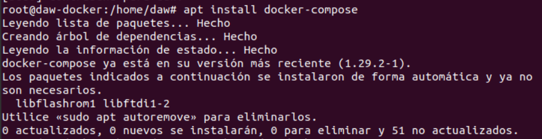
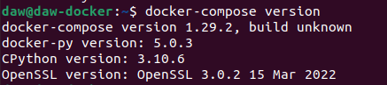
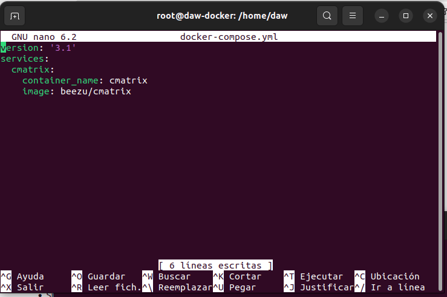
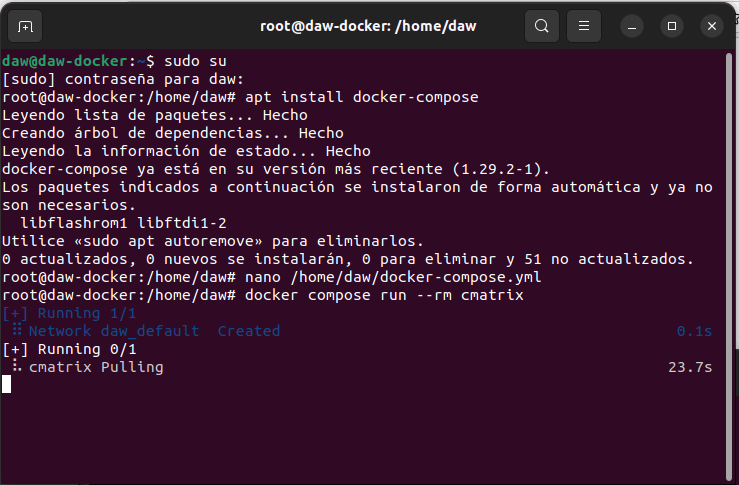
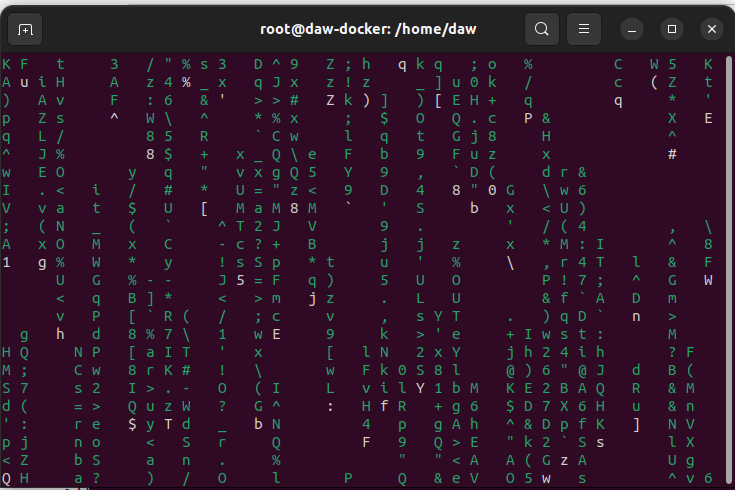
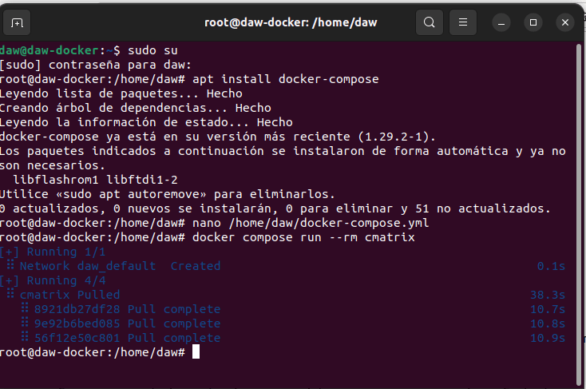

# Docker Proyecto  
> Parte realizada por Ainhoa Salas de Arcos

## Ejercicio 4 - Docker Compose

Desplegar la aplicación cmatrix utilizando docker-compose.

- Antes de empezar a entrar en detalles con el despliegue de ka cmatrix, debemos instalar el Docker Compose para poder trabajar.
````
sudo su (para ototrgar los permisos de administrador en la descarga)
````


````
apt install docker-compose
````


````
docker-compose version (para asegurarnos de que la descarga ha sido completamente efectica comprobamos la version istalada)
````


Entregar los siguientes pantallazos y los comandos empleados para resolver el ejercicio:

- Pantallazo donde se vea el fichero docker-compose.yaml.
````
nano /home/daw/docker-compose.yml (Creamos en la carpeta principal de nuestro directorio el fichero .yaml con los siguientes datos)
````




- Pantallazo donde se vea la aplicación funcionando. Se valorará conseguir el efecto Greenrain.
````
dockercompose run --rm cmatrix (iniciamos la aplicacion cmatrix)
````


````
Podemos comprobar que nos funciona correctamente ya que conseguimos el efecto GreenRain deseado
````


````
Por último salimos de la GreenRain y comprobamos la información que aparece en pantalla tras la ejecución
````


- Explicar brevemente cómo funciona esta aplicación.

Se trata de una cortina de numeros, letras y símbolos que van cayendo en cascada sin ningun fin ni orden definido.

Para salir deberemos pulsar en nuestro teclado CTRL + X.

Para volver a iniciarlo tenedremos que volver a escribir el mismo comando y se activará de nuevo.
