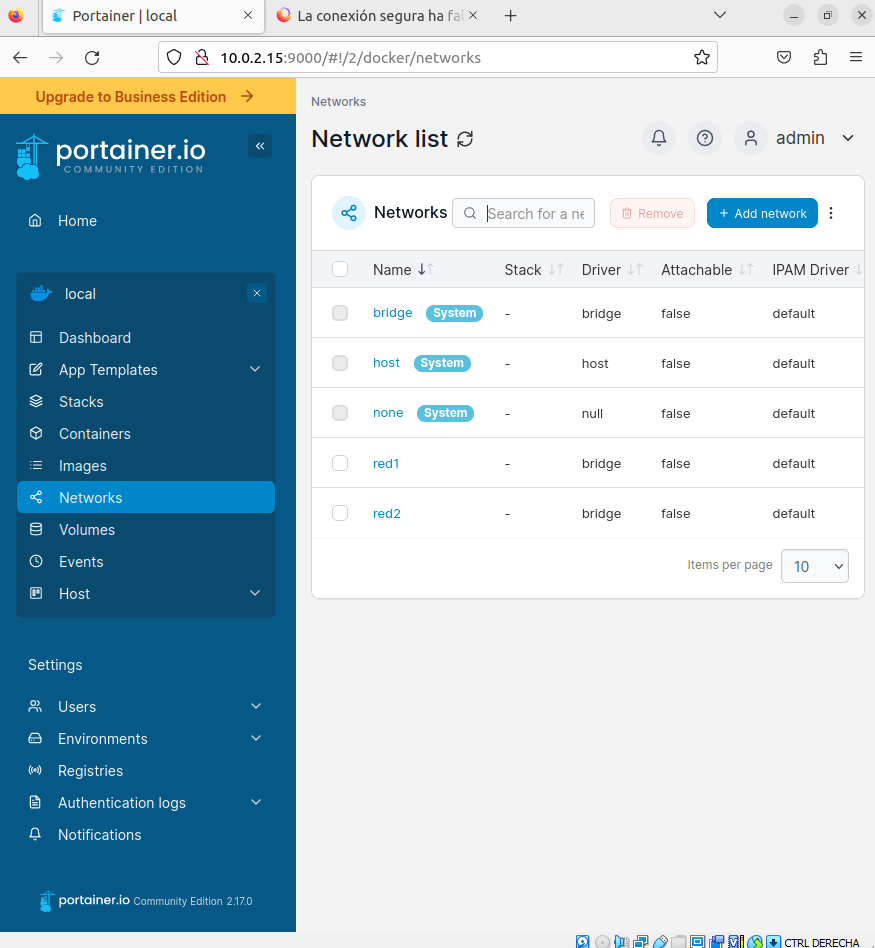

## Ejercicio 2: Portainer
- Lo primero de tpdp será descargar la imagen de portainer para posteriormente crear el contenedor.

- Creamos el contenedor con los volumenes solicitados (lo ubicamos en el puerto 9000 porque es lo recomendado).

- Esta es la vista que obtengo al acceder por el buscador 

- Lo pararé para hacer la demostración

- No se puede acceder desde el buscador
- Lo borramos

- Creo otro: portainer_x

- La aplicacion funciona

- Aqui el contenido de nuestro enviorement

- Aqui las redes, teniendo las que están por defecto.

- Podría borrar una o añadirla, desde esta nterfaz grafica

- Cuenta con un manejador de eventos.

- Ademas de listas de contenedores, host, etc que permiten tant borrar como añadir de forma grafica.
