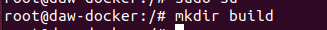

## Docker- Dockerfile

#### Creamos una servidor que sirva un sitio con gninx.
- Lo pirmero será entrar en el root para evitarnos los sudo por cada comando.

- Creamos la carpeta build

- Ahora le daré permisos para todos y la cambiaré al usuario que usaremos en dockerfile

- Me meto en la carpeta y mediante un fichero de texto le indicaré la plantilla

- Tengo aqui mi html

- Usare la imagen httpd:2,4, copiare mi html a hdocs y lo colocaré en el puerto 80
- Creamos la imagen.

- Y ahora la subiremos, iniciaremos sesion

- y ahora la subimos

- Como vemos se subió sin problema

- Me la descargaré yo de nuevo

- Creo un contenedor con dicha imagen

- Y aqui está!

